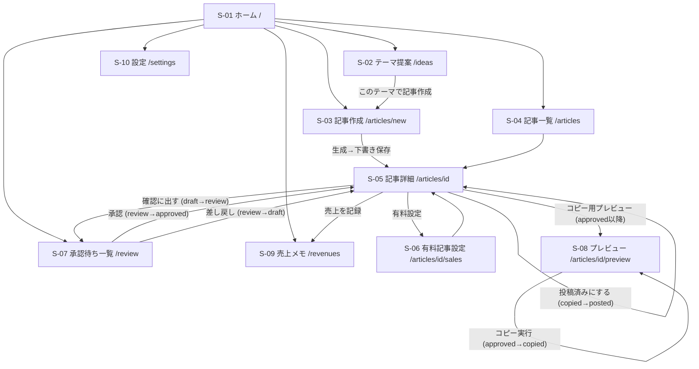

# 03. 画面遷移図



## ステータス遷移（ユーザー操作のみ太字）

```
idea ──記事生成──> draft ──確認に出す──> review ──**承認**──> approved ──コピー──> copied ──**投稿済み記録**──> posted
                     ^                      │
                     └──────差し戻し─────────┘
任意のステータス ──> archived（アーカイブ） / archived ──> draft（復元）
```
